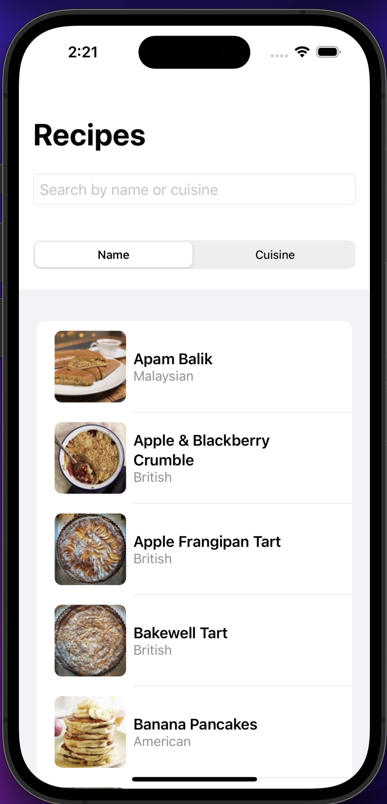
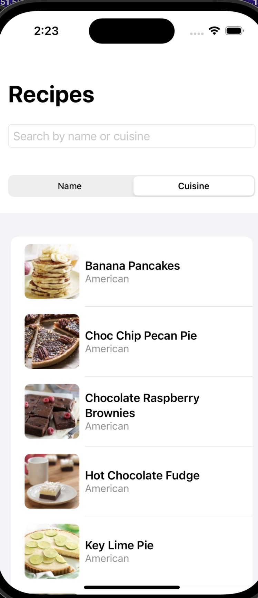
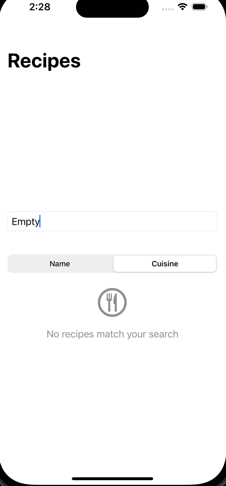
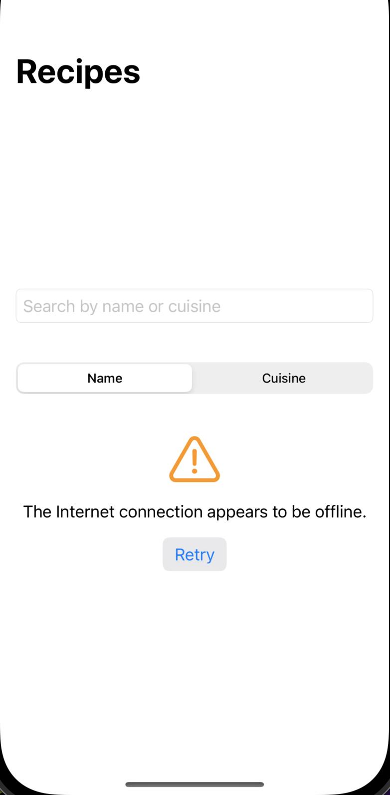

# Fetch iOS Recipe App

A SwiftUI-based iOS application that displays recipes from a provided API endpoint, implementing modern iOS development practices and Swift concurrency.

### Summary

1. Main recipe list view showing the search bar, sort options, and recipe items
 
 
 
 

2. Empty view with No Search Found

 

3. Error view with No Network

 

**Key Features:**
- Display recipes with names, photos, and cuisine types
- Search functionality for filtering recipes by name or cuisine
- Sorting options (by name or cuisine)
- Efficient image loading and caching system
- Proper error handling and empty states
- Pull-to-refresh functionality

**The implementation can be followed through the git commit history, showing the progressive development and improvements made to the application.**

### Focus Areas

1. **Swift Concurrency**
   - Implemented async/await for API calls and image loading
   - Proper error handling with async operations
   - Efficient state management for asynchronous operations

2. **Image Caching**
   - Custom implementation of disk and memory caching
   - Efficient image loading mechanism
   - No reliance on third-party libraries

3. **User Experience**
   - Implemented search and sort functionality
   - Added proper loading, error, and empty states
   - Smooth and responsive UI interactions

4. **Testing**
   - Comprehensive unit tests for core functionality
   - Tests for network calls, image caching, and data manipulation
   - Coverage of error cases and edge scenarios

### Trade-offs and Decisions

1. **Architecture**
   - Chose MVVM pattern for clear separation of concerns and SwiftUI compatibility
   - Used ObservableObject for state management instead of more complex solutions

2. **Image Caching**
   - Implemented a simple but effective two-tier caching system
   - Prioritized simplicity over complex caching strategies

3. **Error Handling**
   - Focused on user-friendly error messages over detailed technical information
   - Implemented retry functionality for failed network requests

### Weakest Part of the Project

While the current implementation meets all requirements, there are areas that could be improved:

1. **Image Loading**
   - Could implement progressive loading for better user experience
   - Could add placeholder images during loading

2. **Testing Coverage**
   - More UI tests could be added (As this wasn't required)
   - More edge cases could be covered

### Additional Information

1. **Requirements Adherence**
   - No external dependencies used
   - Implemented using SwiftUI
   - Proper error handling for malformed and empty data
   - Efficient network usage with image caching

2. **Future Improvements**
   - Implement favorite recipe functionality
   - Add more sorting/filtering options
   - Add UI to display RecipeItem with more detailed recipe information

3. **Development Process**
   - Followed an iterative development approach
   - Prioritized core functionality before adding enhancements
   - Maintained clean code practices and proper documentation

**NOTE:** The git commit history shows the step-by-step implementation and improvements made throughout the development process. 
